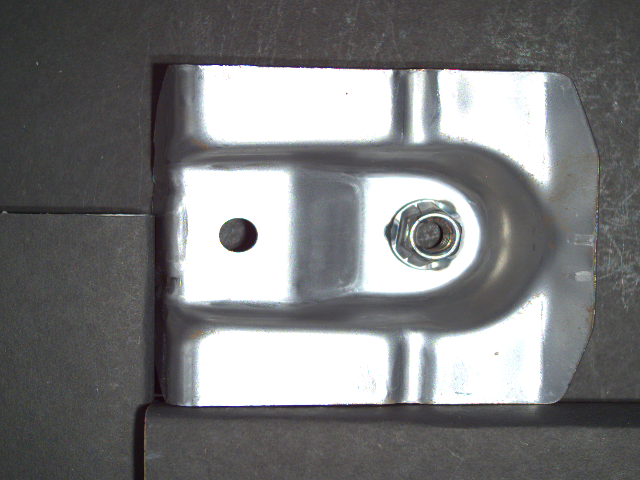
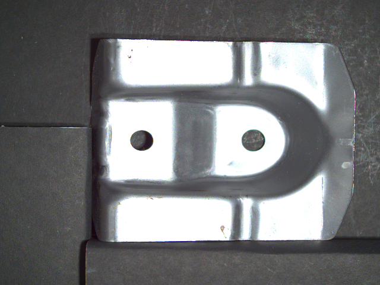

This repository is dedicated to an assigment to identify faults in parts of equipmemnt captured in images. 

Task - 
--------

Good image             |  Bad image
:-------------------------:|:-------------------------:
  |  

The image above on the left is an image of a metallic part without any defects and image above on the left is a sample with a bad part (nut missing). There are going to be different kinds of defects (like rust,dent etc.) present anywhere on the part.

The assignment is to come up with a deep-learning based solution that can differentiate b/w good and bad parts and visualise the location of the defect. The solution should take into account that new types of defects are often discovered in the field and should be designed to incorporate new defects with as few changes as possible.

Pipeline - 
------------

1) Data augmentation -  
	
	For both good and bad image.

2) Classification Neural net -
	
	Siamese nural net (VGGFace model with some changes to the final 2 layers).
	Look at model summary to get the structure. 
	The neural net identifies whther the two images are similar or different

3) Object detection net -

	Object detection model with custom classfiication base model.
	We remove the fully-connected layer responsible for classification in the object detection model.
	We replace it with my model for detecting faults.

3) Segmentation net -

	On the bounding box obtained after the object detection, we apply pretrained model from keras_segmentation module.
	
Other possibilies - 
---------------------

* Siamese neural network - other models to be tested - MobileNet, Resnet,Inception, Xception
